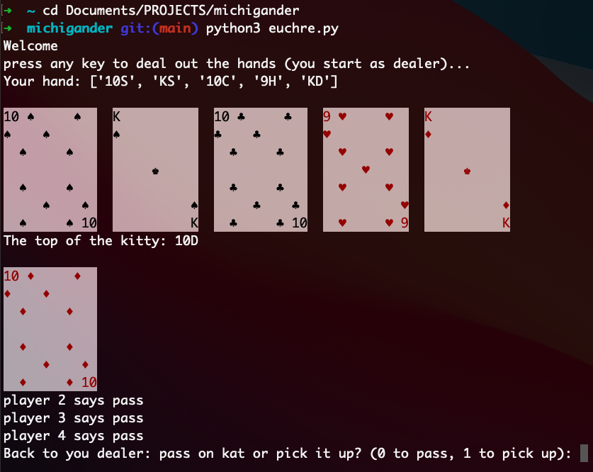

# Michigander
A euchre engine written in Python.

Release --> 0.1

This is currently a buggy euchre game in terminal. 

# Things to do:
- Create classes for card, player, etc.
- Structure code for easier readability
- Determine CPU playing style